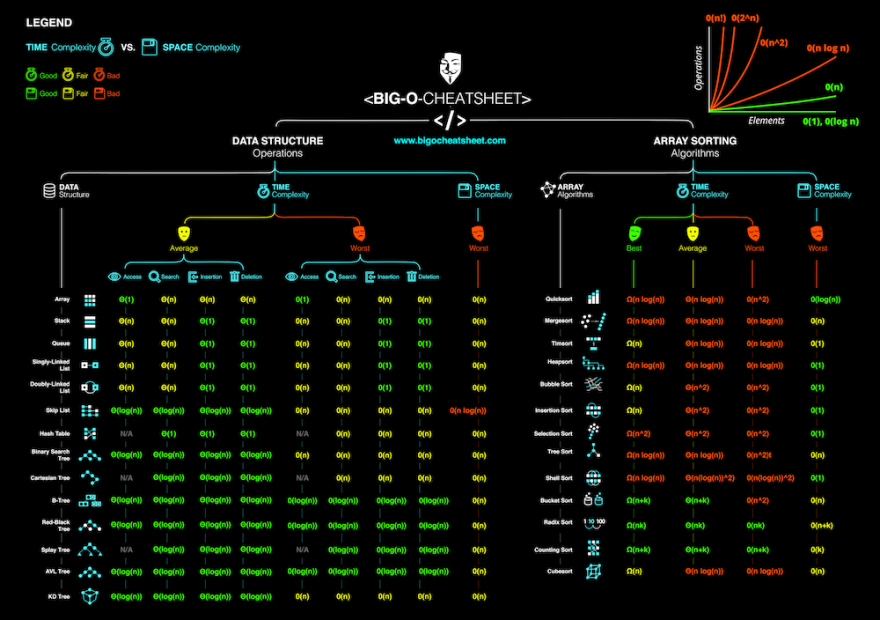

# Study Notes

The purpose of these study notes are to perpare software engineers for technical interviews, by providing bullet points on various subjects in software. These notes are useful for pre-interview study, and they're not written nor intended as a "cheat sheet", so definitely do not use this during an interview! It will not work and you will fail either way if you are considering it!

* **

# Table of Contents

- [Common Algorithms and Complexity Problems](#common-algorithms-and-complexity-problems)
  * [Data Processing](#data-processing)
    + [Optimizations for large datasets](#optimizations-for-large-datasets)
    + [Optimizations for disk-based memory (not in RAM)](#optimizations-for-disk-based-memory--not-in-ram-)
  * [Binary Search Tree (`std::map` - Ordered via BST)](#binary-search-tree---std--map----ordered-via-bst-)
    + [Applications of BST](#applications-of-bst)
  * [Hash map (`std::unordered_map`)](#hash-map---std--unordered-map--)
  * [Singleton](#singleton)
- [System Design and Frameworks](#system-design-and-frameworks)
  * [Content Delivery Network (CDN) Design](#content-delivery-network--cdn--design)
    + [Scrubbers](#scrubbers)
    + [Proxy Servers](#proxy-servers)
    + [DNS with Load Balancing](#dns-with-load-balancing)
    + [Anycast](#anycast)
  * [Load Balancer Design](#load-balancer-design)
  * [ACID-ity](#acid-ity)
  * [Databases](#databases)
    + [Database Sharding](#database-sharding)
    + [SQL vs NoSQL](#sql-vs-nosql)
  * [CAP Theorem (Consistency, Availability, Partition Tolerance)](#cap-theorem--consistency--availability--partition-tolerance-)
  * [Common Tools and Frameworks](#common-tools-and-frameworks)
  * [Common Steps for Designing a Framework](#common-steps-for-designing-a-framework)
    + [Understand the problem and establish a scope (5 mins)](#understand-the-problem-and-establish-a-scope--5-mins-)
    + [Propose a high-level design and get buy-in (20 mins)](#propose-a-high-level-design-and-get-buy-in--20-mins-)
      - [High-level Design Diagram](#high-level-design-diagram)
      - [Data Model and Schema](#data-model-and-schema)
        * [Data Access Patterns](#data-access-patterns)
        * [Read/Write Ratio](#read-write-ratio)
    + [Design Deep Dive (15 mins)](#design-deep-dive--15-mins-)
  * [URL Shortener Example](#url-shortener-example)
    + [Assumptions](#assumptions)
    + [API (REST)](#api--rest-)
    + [Database Design](#database-design)
    + [Algorithm](#algorithm)
    + [Load Balancing](#load-balancing)
  * [Twitter design example](#twitter-design-example)
    + [Core Features](#core-features)
    + [Naive Solution](#naive-solution)
    + [Optimized Solution](#optimized-solution)
  * [Webcrawler Service](#webcrawler-service)
  * [Chat Server](#chat-server)
  * [Design Scope](#design-scope)
  * [Functional Requirements](#functional-requirements)
  * [Non-functional Requirements](#non-functional-requirements)
  * [OAuth2](#oauth2)
  * [GeoIP Geolocation Backend Service](#geoip-geolocation-backend-service)
    + [High-level Design](#high-level-design)
      - [Search API](#search-api)
      - [Business Management API](#business-management-api)
    + [Database Schema](#database-schema)
    + [Total physical sizes](#total-physical-sizes)
    + [Service Design](#service-design)
- [C++ Programming (the language of the old gods and universe)](#c---programming--the-language-of-the-old-gods-and-universe-)
  * [C++ Versions](#c---versions)
    + [C++98](#c--98)
    + [C++03](#c--03)
    + [C++11](#c--11)
    + [C++14](#c--14)
    + [C++17](#c--17)
      - [Structured Bindings](#structured-bindings)
      - [`constexpr`](#-constexpr-)
      - [Fold Expressions](#fold-expressions)
      - [Structured Initialization](#structured-initialization)
      - [Lambdas](#lambdas)
      - [UTF-8 Character literals](#utf-8-character-literals)
      - [Other features](#other-features)
    + [C++20](#c--20)
  * [Compilers](#compilers)
  * [Unit Testing](#unit-testing)
  * [Object Oriented Programming (OOP)](#object-oriented-programming--oop-)
  * [Data Processing in C++](#data-processing-in-c--)
  * [Standard Template Library (STL)](#standard-template-library--stl-)
    + [Containers and Respective Polynomial Times/Complexity](#containers-and-respective-polynomial-times-complexity)
    + [Synchronization and Multi-threading](#synchronization-and-multi-threading)
      - [Observer Model](#observer-model)
      - [Headers](#headers)
      - [Mutexes](#mutexes)
      - [Locks](#locks)
      - [Condition Variables](#condition-variables)
      - [Ordered Execution using `std::condition_variable`](#ordered-execution-using--std--condition-variable-)
        * [Atomics](#atomics)
        * [Memory Order Symantics](#memory-order-symantics)
        * [Common Memory Ordering Use Cases ***](#common-memory-ordering-use-cases----)
      - [Thread objects](#thread-objects)
    + [Smart Pointers](#smart-pointers)
    + [Templates and Metaprogramming](#templates-and-metaprogramming)
      - [Generic Cache Template Example](#generic-cache-template-example)
      - [`decltype`](#-decltype-)
    + [Algorithms](#algorithms)
      - [Sorting](#sorting)
      - [Searching](#searching)
      - [Other Operations](#other-operations)
    + [Iterators](#iterators)
    + [Function Objects](#function-objects)
  * [String Literals](#string-literals)
  * [RAII (Resource Allocation Is Initialization)](#raii--resource-allocation-is-initialization-)
  * [Other C++ notes](#other-c---notes)
  * [Locality](#locality)
  * [Example Questions](#example-questions)
    + [Palindrome](#palindrome)
- [Windows (win32) Interfaces and Internals](#windows--win32--interfaces-and-internals)
  * [Communications and IPC](#communications-and-ipc)
  * [Move and Named Return Value Optimization (NRVO)](#move-and-named-return-value-optimization--nrvo-)
  * [Active Template Library (ATL)](#active-template-library--atl-)
  * [Win32 APIs](#win32-apis)
    + [Named Pipes](#named-pipes)
    + [Mailslots](#mailslots)
    + [Winsocks](#winsocks)
    + [RPC](#rpc)
    + [Memory-mapped files](#memory-mapped-files)
    + [MSMQ](#msmq)
    + [Process Injection](#process-injection)
    + [Registry functions](#registry-functions)
    + [Component Object Model (COM)](#component-object-model--com-)
- [Windows Driver Programming / NT Kernel](#windows-driver-programming---nt-kernel)
  * [IRP Callbacks and Initialization](#irp-callbacks-and-initialization)
    + [`IRP_MJ_DEVICE_CONTROL`](#-irp-mj-device-control-)
  * [IOCTL (I/O Control)](#ioctl--i-o-control-)
  * [IRQLs](#irqls)
    + [`PASSIVE_LEVEL` (IRQL 0)](#-passive-level---irql-0-)
    + [`APC_LEVEL` (IRQL 1)](#-apc-level---irql-1-)
    + [`DISPATCH_LEVEL` (IRQL 2)](#-dispatch-level---irql-2-)
    + [`DEVICE_LEVEL` (IRQL 3-26)](#-device-level---irql-3-26-)
    + [Other IRQLs](#other-irqls)
  * [Synchronization Primitives](#synchronization-primitives)
    + [Spinlocks](#spinlocks)
    + [Mutexes](#mutexes-1)
    + [Semaphore](#semaphore)
    + [Fast Mutex](#fast-mutex)
  * [Executive Resources](#executive-resources)
  * [Dispatcher Objects](#dispatcher-objects)
  * [Interlocked Operations](#interlocked-operations)
  * [Read-Write Locks](#read-write-locks)
  * [Paged Memory](#paged-memory)
  * [Non-paged Memory](#non-paged-memory)
  * [Memory Routines / API](#memory-routines---api)
  * [DMA (Direct Memory Access)](#dma--direct-memory-access-)
  * [Kernel Objects in WDM _TODO_](#kernel-objects-in-wdm--todo-)
  * [Threads _TODO_](#threads--todo-)
  * [User-mode to kernel mode comms](#user-mode-to-kernel-mode-comms)
  * [System Calls](#system-calls)
  * [Functions _TODO_](#functions--todo-)
  * [APC/DPC](#apc-dpc)
  * [Usermode Communications](#usermode-communications)
    + [IOCTL](#ioctl)
- [Python](#python)
  * [Language Symantics](#language-symantics)
  * [Data Structures and Complexity](#data-structures-and-complexity)
    + [list []](#list---)
    + [Tuple ()](#tuple---)
    + [Set {}](#set---)
    + [Dictionary / map](#dictionary---map)
    + [Bytes](#bytes)
    + [bytearray](#bytearray)
    + [deque](#deque)
  * [Decorators](#decorators)
  * [OOP / Python Classes](#oop---python-classes)
    + [Method overriding](#method-overriding)
    + [Method overloading (ie adding two classes together, using a defined operator)](#method-overloading--ie-adding-two-classes-together--using-a-defined-operator-)
  * [List Comprehension](#list-comprehension)
  * [Dictionary comprehension](#dictionary-comprehension)
  * [Generators](#generators)
  * [`with` statement](#-with--statement)
  * [Lambda functions (anonymous functions)](#lambda-functions--anonymous-functions-)
  * [Slicing (like in golang)](#slicing--like-in-golang-)
  * [Unpacking](#unpacking)
  * [`global` and `nonlocal` keywords](#-global--and--nonlocal--keywords)
  * [`yield` keyword](#-yield--keyword)
  * [Ellipsis (`...`)](#ellipsis-----)
  * [Walrus Operator (`:=`)](#walrus-operator-------)
  * [`f` strings, Format strings](#-f--strings--format-strings)
  * [Type hints (Type Annotations)](#type-hints--type-annotations-)
  * [Data Classes (library)](#data-classes--library-)
  * [Other language notes](#other-language-notes)
- [golang Programming Language](#golang-programming-language)
  * [Variables](#variables)
  * [Functions](#functions)
  * [Structs and methods](#structs-and-methods)
  * [Control](#control)
  * [Slices and Arrays](#slices-and-arrays)
  * [Maps](#maps)
  * [Pointers](#pointers)
  * [Goroutines and channels](#goroutines-and-channels)
  * [Interfaces](#interfaces)
  * [Golange packages](#golange-packages)
- [Windows API](#windows-api)
- [Network Engineering and Security](#network-engineering-and-security)
  * [PKI (Public Key Infrastructure)](#pki--public-key-infrastructure-)
    + [Public and Private keys](#public-and-private-keys)
    + [Cryptographic primitives](#cryptographic-primitives)
      - [Symmetric and Asymmetric Ciphers](#symmetric-and-asymmetric-ciphers)
      - [Hash Algorithms](#hash-algorithms)
      - [Key Exchange Algorithms](#key-exchange-algorithms)
      - [Cryptographic Protocols and Suites](#cryptographic-protocols-and-suites)
      - [Message Authentication](#message-authentication)
      - [Stream and Block Ciphers](#stream-and-block-ciphers)
  * [TLS/SSL](#tls-ssl)
- [Malware Analysis and Research](#malware-analysis-and-research)
  * [Target APIs](#target-apis)
    + [Network functions](#network-functions)
    + [File Operations](#file-operations)
    + [Registry](#registry)
    + [Cryptographic functions (ransomware)](#cryptographic-functions--ransomware-)
    + [Dynamic loading](#dynamic-loading)
    + [WMI](#wmi)
    + [Code Injection](#code-injection)
    + [Anti-debugging](#anti-debugging)
  * [Code Injection Techniques](#code-injection-techniques)
    + [DLL Injection](#dll-injection)
    + [Process Hollowing](#process-hollowing)
    + [Remote Thread Injection](#remote-thread-injection)
    + [APC (Asynchronous Procedure Calls) Injection](#apc--asynchronous-procedure-calls--injection)
    + [Sample Hook Injection (C++/Win32)](#sample-hook-injection--c---win32-)
    + [Atom Bombing](#atom-bombing)
    + [Reflective DLL Injection](#reflective-dll-injection)
    + [VEH (Vectored Exception Handling) Hooking](#veh--vectored-exception-handling--hooking)
    + [Thread Execution Hijacking (context hijacking)](#thread-execution-hijacking--context-hijacking-)
  * [Anti-debugging](#anti-debugging-1)
    + [Exception Handling Anti-debugging](#exception-handling-anti-debugging)
    + [Delta computation (Timing Checks)](#delta-computation--timing-checks-)
    + [Check hardware breakpoints](#check-hardware-breakpoints)
    + [Process and Thread Blocks](#process-and-thread-blocks)
    + [PEB (Process Environment Block)](#peb--process-environment-block-)
    + [Parent Process Check](#parent-process-check)
    + [Virtual Machine Detection](#virtual-machine-detection)
  * [Tools](#tools)
    + [Wireshark / TCPDump](#wireshark---tcpdump)
  * [Snort IDS](#snort-ids)
  * [Debuggers](#debuggers)
  * [Static Analyzers](#static-analyzers)
    + [Suricata IDS](#suricata-ids)
    + [Bro/Zeek](#bro-zeek)
    + [Palo Alto NGFW](#palo-alto-ngfw)
    + [YARA](#yara)
    + [Python libraries for automation](#python-libraries-for-automation)
    + [Cuckoo Sandbox](#cuckoo-sandbox)
    + [Debuggers and Analysis Tools](#debuggers-and-analysis-tools)
  * [Attack Vectors (malware)](#attack-vectors--malware-)
  * [Major exploits / vulnerabilities](#major-exploits---vulnerabilities)
  * [Fileless malware](#fileless-malware)
  * [Malicious Techniques](#malicious-techniques)
  * [Detection Techniques](#detection-techniques)
  * [IOCs (Indicators of Compromise)](#iocs--indicators-of-compromise-)
  * [Authentication and Security Frameworks](#authentication-and-security-frameworks)
    + [OAuth 2.0](#oauth-20)
- [File Formats](#file-formats)
  * [PE (Portable Executable)](#pe--portable-executable-)
  * [ELF (Extensible Linkable Format)](#elf--extensible-linkable-format-)

<small><i><a href='http://ecotrust-canada.github.io/markdown-toc/'>Table of contents generated with markdown-toc</a></i></small>


* **

# Common Algorithms and Complexity Problems

## Data Processing

### Optimizations for large datasets

1) Identify bottlenecks **profiling**, **benchmarking**
2) Determine algorithm and data structures 
3) Identify algorithmic efficiency
4) Identify memory allocation/deallocation issues
5) Identify unnecessary instantiation
6) Verify that structures are aligned
7) Use multi-threading and synchronization, if possible
8) Use a thread pool (creating/destroying threads is expensive)
9) Cache optimization (spatial and temporal locality)
10) Compiler optimization flags (`-O3`)
11) Refactoring
12) Loop unrolling
13) Minimize locking
14) Buffering, Batching
15) Scalability

### Optimizations for disk-based memory (not in RAM)

* `mmap` on Linux lets you map the file into memory without reading into memory entirely
* Use a database like NoSQL (Redis)
* Vectorization (SIMD)


## Binary Search Tree (`std::map` - Ordered via BST)

* Sorted by key, using BST
* Automatically sorted using the BST each time an element is inserted


1. Each node has two children, left and right. "If value is greater than node, store in left, otherwise right"
2. Searching is O(log (n)) because for each node that is entered, half of the search tree is not searched
3. No duplications

### Applications of BST
* Sorted dictionary
* Database indexing
* Symbol tables (compilers)

**Insertion** 

Same as **search** since it requires time to find a node to insert into O(log(n))

**Traversal**

Can be done through recursive functions i.e. root, left subtree, right subtree, etc

## Hash map (`std::unordered_map`)

* Key -> hash algo -> integer
* Performance is generally faster (O(1)) for search and insert
* Cache implementations (quick access of resources based on URL)
* Word Frequency count
* Indexes for unordered data


## Singleton

A singleton is a design pattern where only one object of its kind exists and can be accessed. For example a class with a static variable. Each instance of the class ensures that the resource is locked before access (mutex guard)




* **

# System Design and Frameworks
Lookup, full doc: [System Design Interview An Insider’s Guide by Alex Xu (z-lib.org)](https://github.com/G33kzD3n/Catalogue/blob/master/System%20Design%20Interview%20An%20Insider%E2%80%99s%20Guide%20by%20Alex%20Xu%20(z-lib.org).pdf)

**Typical System Design**


## Content Delivery Network (CDN) Design
### Scrubbers
* Prevent DDoS
* Separate malicious from legitimate traffic requests
* Pass request to load balancer

### Proxy Servers
* Deliver content to users
* Cached in RAM

### DNS with Load Balancing
`A` or `AAAA` records or Authoratative Records are used to distribute requests to a specific server, based on subdomain

**Round Robin** DNS requests load balance by having a pool of IP addresses, and allowing each IP to handle requests such that they are equally distributed under load

### Anycast
Mechanism in which multiple servers have one IP address
* Reduces load balancer load 
DSR (Direct Server Return) allows for the server to directly return a response, without needing to route back through a load balancer

## Load Balancer Design
**Requirements**
| Requirements            | L4                    | L7                                                               | DNS                       |
| ----------------------- | --------------------- | ---------------------------------------------------------------- | ------------------------- |
| Data Requirements       | Request Packet Header | Contents of the request                                          | DNS lookup before request |
| Session Security        | SSL passthrough       | TLS termination                                                  | Not impacted              |
| Implementation Location | Hardware or Software  | Software Only                                                    | Fast                      |
| Access to Content       | Content Agnostic      | Inspects and manipulates content (cookies, paths, sessions, etc) | Content agnostic          |

## ACID-ity
* Atomicity is guaranteed
* Consistency in the database is guaranteed, prevents multiple states
* Isolation: transactions are executed concurrently
* Durability: in case of a power failure, is the data retained?

## Databases

| Database Type                           | Solution                                                                                                                                                                                                                                                                                                                                                           |
|-----------------------------------------|--------------------------------------------------------------------------------------------------------------------------------------------------------------------------------------------------------------------------------------------------------------------------------------------------------------------------------------------------------------------|
| Key–value cache                         | Apache Ignite, Couchbase, Coherence, eXtreme Scale, Hazelcast, Infinispan, Memcached, Redis, Velocity                                                                                                                                                                                                                                                              |
| Key–value store                         | Azure Cosmos DB, ArangoDB, Amazon DynamoDB, Aerospike, Couchbase, ScyllaDB                                                                                                                                                                                                                                                                                         |
| Key–value store (eventually consistent) | Azure Cosmos DB, Oracle NoSQL Database, Riak, Voldemort                                                                                                                                                                                                                                                                                                            |
| Key–value store (ordered)               | FoundationDB, InfinityDB, LMDB, MemcacheDB                                                                                                                                                                                                                                                                                                                         |
| Tuple store                             | Apache River, GigaSpaces, Tarantool, TIBCO ActiveSpaces, OpenLink Virtuoso                                                                                                                                                                                                                                                                                         |
| Triplestore                             | AllegroGraph, MarkLogic, Ontotext-OWLIM, Oracle NoSQL database, Profium Sense, Virtuoso Universal Server                                                                                                                                                                                                                                                           |
| Object database                         | Objectivity/DB, Perst, ZODB, db4o, GemStone/S, InterSystems Caché, JADE, ObjectDatabase++, ObjectDB, ObjectStore, ODABA, Realm, OpenLink Virtuoso, Versant Object Database                                                                                                                                                                                         |
| Document store                          | Azure Cosmos DB, ArangoDB, BaseX, Clusterpoint, Couchbase, CouchDB, DocumentDB, eXist-db, Google Cloud Firestore, IBM Domino, MarkLogic, MongoDB, RavenDB, Qizx, RethinkDB, Elasticsearch, OrientDB                                                                                                                                                                |
| Wide-column store                       | Azure Cosmos DB, Amazon DynamoDB, Bigtable, Cassandra, Google Cloud Datastore, HBase, Hypertable, ScyllaDB                                                                                                                                                                                                                                                         |
| Native multi-model database             | ArangoDB, Azure Cosmos DB, OrientDB, MarkLogic, Apache Ignite,[23][24] Couchbase, FoundationDB, Oracle Database                                                                                                                                                                                                                                                    |
| Graph database                          | Azure Cosmos DB, AllegroGraph, ArangoDB, InfiniteGraph, Apache Giraph, MarkLogic, Neo4J, OrientDB, Virtuoso                                                                                                                                                                                                                                                        |
| Multivalue database                     | D3 Pick database, Extensible Storage Engine (ESE/NT), InfinityDB, InterSystems Caché, jBASE Pick database, mvBase Rocket Software, mvEnterprise Rocket Software, Northgate Information Solutions Reality (the original Pick/MV Database), OpenQM, Revelation Software's OpenInsight (Windows) and Advanced Revelation (DOS), UniData Rocket U2, UniVerse Rocket U2 |


### Database Sharding
Spliting Databases into "shards" in order to distribute load along different systems. **MSSQL, Oracle, MySQL,** etc

### SQL vs NoSQL
SQL: Typical table-based relational database. Large physical storage model.

NoSQL: Key-Value (dictionarys). Key is an attribute name, which is linked to a value. **Redis, Voldemort, Dynamo** are examples. Better to scale. Schemas can be added on the fly and are dynamic.

Wide Column Databases: Instead of tables, columnar databases have column families which are containers for rows. Useful for large datasets. Examples are **Cassandra** and **HBase**

Graph Dtabases: Graph based storage (i.e. nodes, entities). Examples: **Neo4J** and **InfiniteGraph**

**Which to Use?**
1. ACID compliance, which requires SQL. If data is structured and unchanging.
2. NoSQL is useful in large volumes of data. Think twitter tweets. Useful in cloud solutions, efficient for large scale databases which are stored in RAM. NoSQL is useful in rapid development and doesn't need to be prepped ahead of time.

## CAP Theorem (Consistency, Availability, Partition Tolerance)


## Common Tools and Frameworks
1. **Amazon S3** (Object Cloud Storage): useful for storing large objects, like pastebin text or images. Easy to scale in cloud

## Common Steps for Designing a Framework
### Understand the problem and establish a scope (5 mins)
* What is the magnitutde of connections?
* How many users?
* Is it a subscription model, and does it require premium users (whereby limiting bandwidth and storage capacity)
### Propose a high-level design and get buy-in (20 mins)
* Design the API (REST)
* Authentication API
* Query for specific data
* Store specific data
* **Do not add APIs that have no functional requirements**

| Method | Path               | Description                           |
| ------ | ------------------ | ------------------------------------- |
| GET    | /v1/businesses/:id | Return detailed info about a business |
| POST   | /v1/businesses     | Add a business                        |
| PUT    | /v1/businesses/:id | Update details of a business (id)     |
| DELETE | /v1/businesses/:id | Delete Business                       |

* If two way communication is required: **websocket**
    * **websocket** is stateful, and stateful architecture is more complex to scale in the backend

#### High-level Design Diagram
* Load Balancer is an **API gateway** (mux library)
* Services require persistence: **databases**, or data storage layer


1. Database scaling
2. High concurrency
3. Failure scenarios

#### Data Model and Schema
##### Data Access Patterns
##### Read/Write Ratio

### Design Deep Dive (15 mins)
Rather open-ended, look into details of the design and correct architecture

## URL Shortener Example
**Functional Requirements**: Given a URL, shorten it. Use a checksum/hash of the input URI? Optionally pick a short link. Expiration. Redirection
**Non-Functional**: Highly-available. Redirection should be immediate. Shortened links should neot be predictable (solved with hash).
**Extended**: Analytics, RESP API (Solved by designing functional requirement API). Requirement for authentication (OAuth2)

### Assumptions
* Can anyone create URLs through API? Does it require a key?
* Some frequently used URLs should be cached
* Traffic will be 100:1 read:write ratio
* Load will be 500m new URLs per month
* 50B redirections per day
* **Traffic estimate**: Queries Per Second: If we have 500million new URLs per month, then `500m / (30days * 24hours * 3600seconds) = ~200URL/s`. Redirections will be `100(read redirections) * 200 URLs/s = 20K/s` (since we have 100x more reads than writes, so 20K/s URLs will be accessed)
* **Storage estimate**: Let's say the URL is stored for 1 month. At 500/m new URLs. Each one is 512bytes in the database. So 512b * 500m = 256,000,000,000 = 256gb of storage per month. For 5 years? 5 * 12 = 60. 60 * 256gb = 15.36TB for 5 years.
* **Bandwidth**: Read? 200URLs/s. Write? 2URLs/s. 128kb for one API redirect. So 128kb * 200URL/s = 25.6MB/s

### API (REST)
* Accessing URLs doesn't require an API, it just reaches the shortener service
* Create URL: Expiry date, api key, user name, original url, custom URL name
* Delete URL: api key, shortened URI name

### Database Design
**URL Table**: URL Hash (PK), Original URL, Creation Date, UserID
**User Table**: User ID (PK), Name, Email, CreationDate

* Since there are no relationships between tables, we can use NoSQL as its faster
* Many objects, lots of queries

### Algorithm
1. Client sends API request to Shorten
2. Shortener sends requrest to Encoder (checksum)
3. Checksum is stored in the database
4. If failed the duplication, add append another unique sequence, like username
5. Return shortened URL to user

### Load Balancing
* Can add a LB between clients and applications, application server and database, applications and cache
* Roundrobin load distribution

## Twitter design example


### Core Features
1. Tweets (sending, receiving, and viewing tweets)
2. Timeline 
    1. User-timeline (list your own tweets)
    2. Home timeline (tweets from people you follow)
3. Following

### Naive Solution
* Relational database design
    * User-table
    * Tweet table

**Tweet Table**
| tweet_id | content                        | user_id         |
| -------- | ----------------------------   | -----------     |
| <*sum*>  | <string 256 characters long>   | <*32bit int*>     |
* Issue with the tweet table is the size, it will increase substantially as it needs to store historical data

**User Table**
| user_id      | User Name | Creation Date |
| ------------ | --------- | ------------- |
| <int 32 bit> | String    | datetime      |

### Optimized Solution
1. Optimize the home page refresh (i.e. fill the user's home page with relevant tweets)
Tweet Send -> REST/HTTP/PUT -> API Proxy (Load Balancer) -> Redis Cluster (In-memory database, can be *n* servers with the same db), 3 machines
* The tweet will trigger a refresh (in redis) of all home pages associated with that user
REDIS Cluster Details
    * Each user has a list/vector of tweets, that represents his home timeline
    * List contains tweet ID, sender ID
* Let's say that Alice sends a tweet, and Alice has 100 followers, then 300 user lists will be refreshed (this is only for active users)
* Issue with this is that if a user has millions of followers, then a million lists will need to be refreshed
* Another issue is that a user home list can be refreshed, while others are not (due to load). So some people see re-tweets while others do not see the original tweet. Still an on-going issue (apparently)
2. Send tweet -> Load balancer -> Followers (?) -- this is unclear


3. Bob Accessing Timeline
Browser (GET) -> Load Balancer -> Redis Cluster (only one in cluster needs to answer; fastest) -> Populate bob's timeline
* There are lots of redis machines in the cluster, only one needs to answer (that contains Bob's list), this can be done through a hash map
* In between the Load Balancer and Redis, there is a hash lookup, that returns the redis IP containing Bob's timeline
4. Searching for tweets? The load balancer send a request to another machine that will hash the tweet

## Webcrawler Service


## Chat Server
* Use HBase (wide column database), database sharding
* Load balancer splits up users into their respective chat servers
* Chat servers can either do push (client pushes messages to server, requires open connection), or pull (clients periodically checks for new messages)
* Each chat server has a connection pool, with a particular client


## Design Scope
1. Clarify requirements
2. Who will be the users? How many users do we anticipate?
3. What features do we need?

* Focus on scale
* Focus on Performance

## Functional Requirements
1. User interactions
2. Data management
3. Business Processes
4. Authentication/Authorization
5. Reporting
6. Error Handling
7. Performance Requirements
8. Integration Requirements (API)
9. Security functions (TLS)

## Non-functional Requirements
1. Performance
2. Reliability
3. Availability
4. Usability
5. Security
6. Maintainability
7. Portability
8. Scalability
9. Compliance
10. Disaster Recovery

## OAuth2
1. Obtain Authentication
2. Exchange an access token
3. Use access token to make requests to API (REST)
4. Refresh token

## GeoIP Geolocation Backend Service
**Functional Requirements**
1. Users can search for businesses: Based on their location, get a map and list of locations of businesses near user
2. Users can add or remove businesses
3. Users can view information about a business

**Non-functional Requirements**
* 100million users (DAU, Daily Active Users)
* 200million businesses
* Latency should be low, users should be able to find nearby businesses quickly
* Highly available, traffic spikes, etc

**Assumptions** and **Calculations**
* Assume a user makes up to 5 queries per day
* 100m DAU (Users)
* 200m Businesses

So: `(100m DAU) x (5 searches per user) = ~5000 queries`

*How much storage do we need for 200m businesses?*
We don't know yet until we design a schema

### High-level Design
Uses REST API
#### Search API
* Search API Request: `GET /v1/search/nearby`
* Note: this API contains the Geo location of the user

| Field     | Description                 | Type   |
| --------- | --------------------------- | ------ |
| latitude  | Business location latitude  | double |
| longitude | Business location longitude | double |
| radius    | Optional. Default is 5KM    | int    |

* Search API Response:
```
{
    "total": 10,
    "business_list": [
        {
            "name": "business_name"
            "location": ...
        }
    ]
}
```
* Pagination, or having a list of responses based on location and relevance, should be included in real life

#### Business Management API
Request:

| API Path                  | Description                  |
| ------------------------- | ---------------------------- |
| GET /v1/businesses/:id    | Return details on a business |
| POST /v1/businesses       | Add a business               |
| PUT /v1/businesses/:id    | Update a business            |
| DELETE /v1/businesses/:id | Delete business              |

### Database Schema
**Business Table**
| Businesses  |    |
| ----------- | -- |
| business_id | PK |
| address     |    |
| city        |    |
| country     |    |
| latitude    |    |
| longitude   |    |

**geospatial_index**
| business_id   | geospatial_index |
| ------------- | ---------------- |
| business_name | location         |

### Total physical sizes
businesses table: 200m * 1kb = 200gb
* Just calculate based on database and size

### Service Design


* Load balancer distributes API, either you search `/search/nearby` or you check business data `/businesses/{:id}`
* **Location Based Service** is read heavy, no write. 5000 QPS (queries per second)
* **Business Service** Handles the requests for the business objects, it writes or modifies the business database

**Database Cluster and Topology**
* Search business dataset is small, but the total business dataset is high


* **
# C++ Programming (the language of the old gods and universe)
__TODO__ Major rewrite of this section


Multi-paradigm language (OOP)
Procedural (C, callback)
Imperative (uses statements to change the state of the program)
Functional
Generic, modular

* **
## C++ Versions
_TODO_
### C++98
### C++03
### C++11
### C++14
### C++17
#### Structured Bindings
`auto [x, y] = std::make_pair(10, 20);`
`std::make_pair()` Create a `std::pair` object

#### `constexpr`

Allows the compiler to conditionally compile a type based on template parameters
```
template <typename T>
void foo(T value) {
    if constexpr (std::is_integral_v<T>) {
        // Compiled if code is an integral type
    }
}
```

#### Fold Expressions
Variadic template code
```
template <typename... Args>
auto sum(Args... args) {
    return (args + ...);
}
```

#### Structured Initialization
```
struct Point {
    int x;
    int y;
};

Point p{10, 20};
```

#### Lambdas
`constexpr auto add = [](int x, int y) { return x + y; };`

#### UTF-8 Character literals
_more on string literals below_
`u8'€'; // utf8_char type`

#### Other features
`std::variant`
`std::for_each` iterator
`<filesystem>` header
`std::make_unique<T>` initializes a `unique_ptr` of type `T`

### C++20

Personal study notes.
test

## Compilers
LLVM
VC++
gcc
CLang
Intel C++

## Unit Testing
_TODO_

*gtest* package from Google

## Object Oriented Programming (OOP)
Really over-simplified version of OOP
* Encapsulation
    *Classes* 
    Wrapping data and information in a single unit, _I.E. encapsulating complexity away from the whole, by limiting it to a single object_
* Inheritance
    The concept of a class inheriting the properties, state, or variables of another class
    *Derived Class*: the class that inherits from another class (i.e. child)
    *Base Class*: the class being inherited from
* Polymorphism
    Achieved through function overriding (separate from *overloading*, which allows one function to have multiple signatures and definitions)
    In greek: _Taking many forms_ 
    ```
    class A {
        public:
        int func(void) {
            return 1;
        }
    };

    class B : public A {
        public:
        int func(void) { // func is overridden by class B implementation
            return 2; 
        }
    }
    ```
* Abstraction
    Virtual functions and interface classes (i.e. pure virtual classes)
    
    Useful for abstracting away the complexity of a certain class, for example:
        `class Logger` is an interface class, it can log to either OutputDebugString(), stdout, or to a file. It has purely virtual methods:
        `virtual int func(std::string s) = 0;`
        `class ConsoleLogger : Public Logger` implements `func`, such that the definition of `func` outputs to stdout

## Data Processing in C++
* **Primitive Datatypes** include `int`, `floats`, `char`, `double`, `bool`. 
* **Composite Datatypes** include `struct`, `class`, `std::array`, STL containers, database records, etc
* **Files and Streams** include text, binaries, network streams (TCP/IP), CSV, JSON, XML, serialization
* **Containers and Data Structures** include STL, `std::vector`, `std::list`, `std::array`. Data processing is achieved by algorithms (see complexity): searching, sorting, filtering, access, etc

**Applications**
1) Numerical and scientific computing
2) Data Analysis and Machine Learning
3) Game dev
4) System monitoring utilities
5) Network programming

## Standard Template Library (STL)
### Containers and Respective Polynomial Times/Complexity
* `std::vector<>` (dynamic expand array, similar to a C array but you can iterate and push to it)
    access: O(1)
    insert/remove at end O(1)
    insert remove at middle O(n)
* `std::list` (essentially a linked list)
    access: O(n) at worst, search is not ideal
    insert/remove (beginning or end): O(1), relatively fast, otherwise O(n) at worst
* `std::deque` (double ended fast insert queue)
    access: O(1)
    insert at beginning or end: O(1), middle is O(n)
* `std::queue` (pretty much a queue)
    push: O(1)
    pop: O(1)
* `std::map` (dictionary)
    access, insert, removal: O(log(n)) <- hella fast
* `std::set` (unique keys in sorted order)
    _TODO_
    access, insert, remove: O(1) best, O(n) worst
* `std::unordered_set` (same as above, but not ordered based on element insertion/deletion)
* `std::pair` Pair, can be any type, simple container
* `std::tuple` Tuple can hold a collection of elements, each can be a different type

### Synchronization and Multi-threading


*See `signal.h` for a good example of this
Do not forget `std::unique_lock`, at end of scope, release an `std::mutex`
`std::unique_lock<std::mutex> mlock(syncMutex);`

#### Observer Model

https://refactoring.guru/design-patterns/observer/cpp/example

An observer is a design pattern in C++ that allows objects (observers) to be signalled when an state change ocurrs. This is especially useful in GUI programming.


#### Headers
```
<thread>
<mutex>
<future>
<atomic>
<condition_variable>
```

```
bool isRunning = false;

void func1(int param)
{
    while (isRunning) {
        Sleep(1000);
    }
}

int main(void)
{
    std::thread new_thread(func1, 0);

    new_thread->detach();

    Sleep(1000);

    isRunning = false;
    if (std::thread->is_joinable()) {
        std::thread->join();
    }

    return 0;
}
```

#### Mutexes
`std::mutex` `std::recursive_mutex` `std::timed_mutex` `std::recursive_timed_mutex`

#### Locks
Locks are used in RAII, used for synchronizing access to resources 
* `std::lock_guard` Locked on construction, unlocked on destruction, out of scope
* `std::unique_lock` Used in conjunction with `condition_variable`, can be locked and unlocked
* `std::scoped_lock` (C++17)

#### Condition Variables
* Used om conjunction with `std::unique_lock` 
* Condition variables that allow for safe management of `std::thread`
* Essentially wait for certain conditions to become true
* Used in conjunction with mutexes to synchronize threads, for example, **the condition variable waits until a mutex is released**

`std::condition_variable` in `<condition_variable>`

**Example in which you can send multiple signals to waiting threads, each will wait with a `condition_variable` until `mtx` is signalled**
```
std::mutex mtx;
std::condition_variable cv;
bool ready = false;

void worker(void) {

    // Acquire the mutex. i.e. reach the `CRITICAL_SECTION` for `lock`
    std::unique_lock<std::mutex> lock(mtx);

    // Wait until the lock is signalled, then execute lambda predicate
    cv.wait(lock, []{ return ready; });
}

void signal(void) {
    {
        std::lock_guard<std::mutex> lock(mtx);
        ready = true;
    }

    cv.notify_one();
}
```

#### Ordered Execution using `std::condition_variable`

This allows for each thread to be dispatched in the order that it was locked

```
std::mutex mtx;
std::condition_variable cv;
int order = 0;

void threadFunction(int id) {
    std::unique_lock<std::mutex> lock(mtx);
    cv.wait(lock, [id]{ return order == id; });
    std::cout << "Thread " << id << std::endl;
    order++;
    cv.notify_all();
}
```

##### Atomics
`std::atomic` used for atomic (interlocked) operations in C++

##### Memory Order Symantics
* relaxed (`memory_order_relaxed`): There are no ordering or synchronization constraints, except the modification is interlocked
* consume (`memory_order_consume`): Rarely used _TODO_
* acquire (`memory_order_acquire`): Ensures that memory writes before the atomic operation are not moved after it.
* release (`memory_ordr_release`): Ensures that memory writes after the atomic operation are not moved before it.
* acquire-release (`memory_order_acq_rel`): Combines both acquire and release semantics.
* sequentially consistent (`memory_order_seq_cst`): The strongest memory ordering, ensuring a total order of all sequentially consistent operations.

```
std::atomic<int> counter(0);

void increment() {
    for (int i = 0; i < 10000; ++i) {
        counter++;
    }
}

int main() {
    std::vector<std::thread> threads;

    // Create 10 threads to increment the counter
    for (int i = 0; i < 10; ++i) {
        threads.emplace_back(increment);
    }

    // Wait for all threads to finish
    for (auto &thread : threads) {
        thread.join();
    }

    std::cout << "Counter value: " << counter << std::endl;

    return 0;
}
```

##### Common Memory Ordering Use Cases ***
1. `std::memory_order_seq_cst` (Sequentially constant)
* Default memory order for atomics, strictest and most intuitive memory order. 
* Prevents any reordering of read/write operations
* Is not ideal for performance
2. `std::memory_order_acquire` and `std::memory_order_release`
* Used for implementing mutexes, condition variables (), designing lock free data structures
3. `std::memory_order_relaxed` 
* No ordering requirements, very fast
* Statistics collection, flag settings, **counter increments**

```
std::atomic<bool> flag(false);

flag.store(true, std::memory_order_seq_cst);
flag.load(std::memory_order_seq_cst);
```

#### Thread objects
`std::thread tNewThread = std::thread(callback, 0);`

`std::thread` object containing an instance of a thread

`thread->join()`, `thread->detach()`, `thread->is_joinable()`

### Smart Pointers
Smart way to make unsafe pointer allocation/deallocation in C safer by performing automatic garbage collection

`std::unique_ptr<TypeObj> a = PtrTypeObjFactory();` Creates a `std::unique_ptr`, using a factory. 

`std::unique_ptr` own their pointer uniquely. When the `std::unique_ptr<>` instance goes out of scope, it will automatically destroy the object to which it points

`std::shared_ptr<>` holds a reference count. Once the reference count reaches 0, and all instances of the object are out of scope, delete the object pointed to by the shared_ptr

`std::auto_ptr<>` aye

### Templates and Metaprogramming

#### Generic Cache Template Example
```
template<typename Key, typename Value>
class Cache {
public:
    struct CacheItem {
        Value value;
        std::chrono::steady_clock::time_point expiryTime;
    };

private:
    std::unordered_map<Key, CacheItem> cacheMap;
    std::mutex cacheMutex; // For thread safety
    std::chrono::seconds defaultTTL; // Time-to-live for each cache item

public:
    Cache(std::chrono::seconds ttl) : defaultTTL(ttl) {}

    void put(const Key& key, const Value& value, std::chrono::seconds ttl = std::chrono::seconds(0)) {
        std::lock_guard<std::mutex> lock(cacheMutex);
        auto expiryTime = std::chrono::steady_clock::now() + (ttl.count() > 0 ? ttl : defaultTTL);
        cacheMap[key] = {value, expiryTime};
    }

    bool get(const Key& key, Value& value) {
        std::lock_guard<std::mutex> lock(cacheMutex);
        auto it = cacheMap.find(key);
        if (it != cacheMap.end() && it->second.expiryTime > std::chrono::steady_clock::now()) {
            value = it->second.value;
            return true;
        }
        return false;
    }

    void removeExpiredItems() {
        std::lock_guard<std::mutex> lock(cacheMutex);
        auto now = std::chrono::steady_clock::now();
        for (auto it = cacheMap.begin(); it != cacheMap.end(); ) {
            if (it->second.expiryTime <= now) {
                it = cacheMap.erase(it);
            } else {
                ++it;
            }
        }
    }
};
```

_TODO_

*SFINAE* (Substitution failure is not an error) 

Invalid substitution may not necessarily indicate an error

https://en.wikipedia.org/wiki/Substitution_failure_is_not_an_error#:~:text=Substitution%20failure%20is%20not%20an%20error%20(SFINAE)%20is%20a%20principle,to%20describe%20related%20programming%20techniques.

#### `decltype`
Retrieves the type of the variable, useful in templates:
```
int a = 5;
    decltype(a) b = a; // evaluates to int b = a;

decltype(auto) func(void) {
    int x = 5;
    return (x); //returns int& since x is an lvalue
}
```

### Algorithms
_TODO_
`<algorithm>` header

#### Sorting
`std::sort`
`std::stable_sort`
`std::partial_sort`

#### Searching
`std::find`, `std::binary_search`, `std::lower_bound`, `std::upper_bound`

#### Other Operations
`std::copy`, `std::move`, `std::replace`, `std::remove`, `std::merge`, `std::accumulate`

### Iterators
_TODO_
* Input Iterators, for reading; moving forward
* Output Iterators: For writing, moving forward
* Bidirectional Iterators: for rw, bi-directional
* Random Access Iterators
`std::begin()`, `std::end()`, `std::iterator`, `std::const_iterator`
`std::transform()`, `std::for_each()`

### Function Objects
_TODO_
<functional> header (functional programming)
*lambda expressions*

## String Literals
_TODO_ Improve on this.
```
	R"(\)" <- literal string, \ does not escape (const char *)
	L"asdfasdf" <- UTF-8 string (wchar_t)
	u"test" const char16_t* (UTF-16)
	U"test" const char32_t* (UTF-32)
```

## RAII (Resource Allocation Is Initialization)
A terrible name for a beautiful concept: encapsulating the lifecycle of a resource within a class constructor and destructor. Once the scope of the class has ended, the resource is automatically free'd. This can be implemented through the class constructor and destructor.

* Encapsulate a resource into a class, for example, a `HANDLE`'s lifecycle is managed by a `class`
* Access the resource via class, for example, interfacing with `HANDLE` is done via calling `class` methods
* The resource must be freed once at end of scope, _ie call on the destructor_

## Other C++ notes
* `vftable` or `vtable` is an array of function pointers that point to the definitions for that particular class
* **Livelock**: when two threads are running, polling, and waiting on each other for some event, thus a cyclic depedency and the threads become locked
* **Starvation**: indicates what the name suggests: a thread is perpetually denied access to a resource that are being locked by other competing threads. Occurs when lock aquisition is not fair, thus starvation

## Locality 
_not just C++, but a concept in architecture_
Refers to the access of the same value or related storage location
* **Temporal Locality**: Reuse of data in small time frames. For example in memory, if an address is accessed, there is a high chance it will be accessed again
* **Spatial Locality**: Refers to frequently used memory that are within close proximity, useful in caching

**Implementations and examples of Locality**
1. Caching: Both forms of locality are crucial for the effective design and utilization of cache memory in computing systems. Caches keep frequently accessed data and instructions close to the CPU to reduce the access time, and a good understanding of locality patterns can significantly enhance cache performance.

2. Algorithm Design: Algorithms can be optimized for better performance by arranging data structures and access patterns to maximize locality. For instance, iterating through an array sequentially exhibits high spatial locality, which is generally more cache-friendly than randomly accessing array elements.

3. Memory Hierarchy Design: Computer architectures are designed considering locality principles. This includes the implementation of various levels of caching (L1, L2, L3 caches), and the design of RAM and virtual memory.

4. Prefetching Strategies: Understanding data access patterns allows for effective prefetching, where the processor anticipates the needed data and loads it into the cache in advance.

**Summary**
    Deadlock: Threads are stuck waiting for each other, and there is no change in state without external intervention.
    Livelock: Threads are actively changing their state in response to each other, but no progress is made.
    Starvation: Some threads are unable to make progress because others are monopolizing the resources. The monopolizing threads are making progress.

## Example Questions

### Palindrome
```
bool isPalindromeUsingLetterFrequency(const std::string& input) {
    std::unordered_map<char, int> freqMap;

    // Count the frequency of each letter, ignoring case and non-alphabetical characters
    for (char ch : input) {
        if (std::isalpha(ch)) {
            freqMap[std::tolower(ch)]++;
        }
    }

    int oddCount = 0;
    for (const auto& pair : freqMap) {
        if (pair.second % 2 != 0) {
            oddCount++;
        }
    }

    // If the string's length is odd, allow for one odd-count character (middle character in a palindrome)
    // If the string's length is even, no characters should have an odd count
    int effectiveLength = 0; // This counts only alphabetical characters, considering the assumption
    for (const auto& pair : freqMap) {
        effectiveLength += pair.second;
    }
    
    if (effectiveLength % 2 == 0) {
        return oddCount == 0;
    } else {
        return oddCount == 1;
    }
}
```

* **
# Windows (win32) Interfaces and Internals
The glorious Win32 API and kernel!
## Communications and IPC
* **IOCTL** Communication between usermode and kernelmode. Remember that this is works by usermode calling on kernel mode using a particlar IOCTL code
* **Kernel Object Manipulation** Direct manipulation of kernel objects: i.e. threads, processes, etc
* **Remote Procedure Call (RPC)** Windows and UNIX protocol for defining callbacks in a master, called by slave applications
* **Mailslots** One-way IPC, applications register a mailslot and receive data from a single sender
* **Named Pipes** Named pipes are files/device objects that can be read and written to, and therefore allows for IPC and interfacing with drivers
* **Sockets** Useful for TCP/IP, can be used for IPC or "remote" IPC through the network, and using the network stack
* **Synchronization** Primitives are explained below
* **File System Communication** File I/O. Process can communicate through the fs
* **System Calls (syscalls)** Mechanism for calling the kernel via syscalls, mostly wrapped by `ntdll.dll` and `kernel32.dll`
* **Shared Memory** See below for APIs, but essentially `OpenProcess()`, `WriteProcessMemory()`, `MapViewOfSection()`, etc...
* **Message Queue (MSMQ)** MQ implementation from MS
* **Component Object Model (COM)** and **DCOM**, an extension of COM that allows for IPC and shared global objects, which can communicate over the network

## Move and Named Return Value Optimization (NRVO)
```
#include <iostream>

class Foo
{
public:
    int x = 0;

    // default ctor
    Foo()
    {
        std::cout << "Default ctor\n";
    }

    // copy ctor
    Foo(const Foo& rhs)
    {
        std::cout << "Copy ctor\n";
    }
};

Foo CreateFooA()
{
    return Foo();
}

Foo CreateFooB()
{
    Foo temp;
    temp.x = 42; // update member variable
    return temp;
}

int main()
{
    Foo t1(CreateFooA()); 
    Foo t2(CreateFooB()); // Object created twice
   
    return 0;
}
```

1. CreateFooA() creates a temporary Foo object to return.
2. The temporary object will then be copied into the object that will be returned by CreateFooA().
3. The value returned by CreateFooA() will then be copied into t1.

## Active Template Library (ATL)


## Win32 APIs
### Named Pipes
`CreateNamedPipe()`, `ConnectNamedPipe()`, `CreateFile()`, `ReadFile()`, `WriteFile()`
### Mailslots
`CreateMailslot()`, see above create/read/write file
### Winsocks
`WSASocket()`, `bind()`, `send()`, `recv()`, `listen()`, `accept()`
### RPC
_TODO_ Lookup MSRPC implementation
`RpcBindingFromStringBinding()`, `RpcBindingSetOption()`, `RpcStringBindingCompose()`
### Memory-mapped files
`CreateFileMapping()`, `MapViewOfFile()`
### MSMQ
`MQOpenQueue()`, `MQSendMessage()`, `MQRecvMessage()`
### Process Injection
`LoadLibrary()`, `CreateRemoteThread()`, stop thread, alter register state (`rip`) and resume thread
* Process Hollowing: Create suspended process, replace text segment resume thread
`WriteProcessMemory()`, `VirtualAllocEx()`
### Registry functions
_TODO_

### Component Object Model (COM)
* `IUnknown`: provides methods for reference counting an object, all objects must contain an IUnknown interface
* IDL (Interface Definition Language) used to define interfaces (in COM and DCOM/RPC)
`CoCreateInstance()`, `AddRef()` method, `Release()`, to increment or decrement reference count to an object

```
    CoCreateInstance()
    WMI L"ROOT\\CIMV2"
    FileSystem objects 
    ActiveX
    IE COM objects (Navigate())	
```

* **
# Windows Driver Programming / NT Kernel
* Windows Driver Framework (WDF) is newer than Windows Driver Model (WDM)
* Windows Filtering Platform (WFP)
* WDF (Windows Driver Framework)
* KMDF (Kernel-Mode Driver Framework)
* Minifilter: (filesystem and file i/o)

## IRP Callbacks and Initialization
```
DRIVER_OBJECT *drvObj = getDrvObj(); // Obtain driver object (i.e. instance of current driver)

// Set callbacks for DRIVER_DISPATCH
drvObj->MajorFunction[IRP_MJ_CREATE] = driverMyCreateHandler;
drvObj->MajorFunction[IRP_MJ_DEVICE_CONTROL] = driverDeviceControlHandler; 
```

### `IRP_MJ_DEVICE_CONTROL`
__Callback for usermode IOCTL__
```
drvObj->MajorFunction[IRP_MJ_DEVICE_CONTROL] = driverDeviceControlHandler; 

// IOCTL definitions
#define IOCTL_CTD_CMD_REQUEST \
   CTL_CODE(FILE_DEVICE_UNKNOWN, 0x101, METHOD_BUFFERED, FILE_READ_DATA | FILE_WRITE_DATA)

// Sample callback from usermode
NTSTATUS driverDeviceControlHandler(PDEVICE_OBJECT DeviceObject, PIRP irp)
{
    PIO_STACK_LOCATION sp = IoGetCurrentIrpStackLocation(irp);

    switch (sp->Parameters.DeviceIoControl.IoControlCode) {
    case IOCTL_CTD_CMD_REQUEST: // IO_BUFFERED request

    case IOCTL_CTD_CMD_RESPONSE:

    default:

    }
}
```

## IOCTL (I/O Control)
Initialally, open a file handle to the driver: `CreateFile(L"\\\\.\\YourDeviceName");`, then `DeviceIoControl()` is called from usermode, specify particular IOCTL:
```
#define IOCTL_CTD_CMD_REQUEST \
   CTL_CODE(FILE_DEVICE_UNKNOWN, 0xa01, METHOD_BUFFERED, FILE_READ_DATA | FILE_WRITE_DATA)

#define IOCTL_CTD_CMD_RESPONSE \
   CTL_CODE(FILE_DEVICE_UNKNOWN, 0xa02, METHOD_BUFFERED, FILE_READ_DATA | FILE_WRITE_DATA)
```

Driver intercepts code by setting the IRP callback:

`DriverObject->MajorFunction[IRP_MJ_DEVICE_CONTROL] = MyIoctlHandler;`

From there, switch IOCTL codes:

`switch (irpSp->Parameters.DeviceIoControl.IoControlCode) {}`

## IRQLs
### `PASSIVE_LEVEL` (IRQL 0)
* Most code runs at passive
* Thread execution
* I/O
* Paged memory access
* Synchronization primitives
* Handles system calls
* `KMUTEX`, semaphores, spinlock, etc

### `APC_LEVEL` (IRQL 1)
* Handles Asynchronous Procedure Calls (APCs) from services
* Allows fast mutex

### `DISPATCH_LEVEL` (IRQL 2)
* Deferred Procedure Calls (DPCs) _TODO_ how do DPCs differ from APCs?
* Non-paged memory access only
* Fast mutex
* Direct Memory Access (DMA)

### `DEVICE_LEVEL` (IRQL 3-26)
* Interrupt Service Routines (ISRs) run at this level, which are callbacks from devices, these respond to hardware interruprs

### Other IRQLs
* `PROFILE_LEVEL` (IRQL 27)
* `CLOCK_LEVEL` (IRQL 28)
* `IPI_LEVEL0` (IRLQ30)
* `POWER_LEVEL` (IRQL 30)
* `HIGH_LEVEL` (IRQL 31), for critical operations; cannot be context switched or interrupted


* "Once a CPU is executing at an IRQL above PASSIVE_LEVEL, an activity on that CPU can be preempted only by an activity that executes at a higher IRQL."
* The IRQLs between DISPATCH_LEVEL and PROFILE_LEVEL are reserved for hardware 
* "Always access shared data at the same elevated IRQL."
* "Code executing at or above DISPATCH_LEVEL must not cause page faults."

[Interrupt Request Level - Primer](https://www-user.tu-chemnitz.de/~heha/oney_wdm/ch04c.htm)


## Synchronization Primitives
### Spinlocks
* Poll until release of spinlock
* IRQL >= DISPATCH_LEVEL, raises IRQL, operates at DISPATCH_LEVEL
* KeAcquireSpinLock() KeReleaseSpinLock()

### Mutexes
* `KMUTEX`
* IRQL is `PASSIVE_LEVEL`
* `KeInitializeMutex()`, `KeWaitForSingleObject()`, `KeReleaseMutex()`

### Semaphore
* Controlling access to a resource pool
* `PASSIVE_LEVEL`
* `KeInitializeSemaphore()` `KeWaitForSingleObject()` `KeReleaseSemaphore()`

### Fast Mutex
_TODO_ Get code sample
* `APC_LEVEL`
* `ExAcquireFastMutex()` `ExReleaseFastMutex()`

## Executive Resources
* More flexible than mutexes, allowing shared and exclusive access
* `PASSIVE_LEVEL`
* `ExInitializeResourceLite()` `ExAcquireResourceExclusiveLite()` `ExReleaseResourceLite()`

## Dispatcher Objects
* Event Signalling
* `PASSIVE_LEVEL`, `APC_LEVEL`
* `KeSetEvent()` `KeWaitForSingleObject()`

## Interlocked Operations
* Any IRQL
* `InterlockedIncrement()` `InterlockedCompareExchange()`

## Read-Write Locks
* `PASSIVE_LEVEL`
* `ExInitializeResourceLite()`

## Paged Memory
* `PASSIVE_LEVEL` can/should use, `APC_LEVEL`
* `ExAllocatePoolWithTag(PagedPool, 'Efl\0');`
* Can result in page faults, therefore cannot be used for higher IRQLs

## Non-paged Memory
* Greater than or equal to `APC_LEVEL` requires nonpaged memory
* ExAllocatePoolWithTag(NonPagedPool)
* Cannot be paged out

## Memory Routines / API
* `MmAllocateContiguousMemory()`
* `ExAllocatePoolWithTag()`
* `RtlZeroMemory()`
* `ExFreePoolWithTag()`

## DMA (Direct Memory Access)
`MmAllocateContiguousMemory()`

## Kernel Objects in WDM _TODO_
* IRP I/O Request Packets
* Driver Object
    * PDO (Physical Device Objects)
    * FDO (Filter Device Object)
* Dispatch Routine
    * `DriverEntry()`
* Lookaside Lists
* Event Objects
* Registry objects
* Security Descriptors
    * `RtlInitUnicodeString(&sddlString, L"D:P(A;;GA;;;SY)(A;;GA;;;BA)");`

## Threads _TODO_
`PsCreateSystemThread()`

## User-mode to kernel mode comms
* IOCTL
* Read/Write Requests ReadFile(), WriteFile()
* Memory mapped I/O (between user and kernel mode)
* System calls
* Shared memory
* Named pipes, mailslots
* WMI

## System Calls
* `SYSENTER`, `INT 0x2e`
* SSDT (System Service Dispatch Table)

## Functions _TODO_
* `KeInsertQueueDpc()` `KeRemoveQueueDpc()`
* `ZwReadFile()` `ZwWriteFile()`
* `ZwCreateKey()` `ZwQueryValueKey()`
* `ZwQuerySystemInformation()` `ZwSetSystemInformation()` `PASSIVE_LEVEL`

## APC/DPC
**Asynchrnous Procedure Calls**

IRQL: APCs typically run at PASSIVE_LEVEL or APC_LEVEL. The PASSIVE_LEVEL is the lowest level, allowing for most thread-based and user-mode operations. APC_LEVEL is slightly above PASSIVE_LEVEL but below DISPATCH_LEVEL, designed to allow certain kernel-mode operations to be performed asynchronously while blocking lower priority operations.

Purpose: APCs are used to execute operations asynchronously in the context of a specific thread. There are two types of APCs: User APCs, which can be delivered only when a thread is in an alertable state waiting for an event (thus executing in user mode), and Kernel APCs, which are executed when the thread is running in kernel mode but at a lower IRQL, allowing for preemptive multitasking within the kernel.

**Deferred Procedure Calls**

IRQL: DPCs are executed at DISPATCH_LEVEL, which is higher than APC_LEVEL and is used for high-priority kernel-mode operations that do not require immediate attention but must be executed before the system can attend to lower-priority tasks.

Purpose: DPCs are primarily used for deferred execution of kernel-mode functions, typically as a response to hardware interrupts. When an ISR concludes that a longer processing task is needed but not necessarily immediately, it can schedule a DPC to perform this task. Because DPCs run at DISPATCH_LEVEL, they preempt most other activities in the system, ensuring that the deferred task is executed relatively quickly but without disrupting the handling of current hardware interrupts.

## Usermode Communications
### IOCTL
_https://learn.microsoft.com/en-us/windows-hardware/drivers/kernel/buffer-descriptions-for-i-o-control-codes_
```
METHOD_BUFFERED
METHOD_IN_DIRECT
METHOD_OUT_DIRECT
METHOD_NEITHER
```
```
DriverObject->MajorFunction[IRP_MJ_DEVICE_CONTROL] = MyIoctlHandler;
IoGetCurrentIrpStackLocation()
switch (irpSp->Parameters.DeviceIoControl.IoControlCode) {}
#define IOCTL_MY_OPERATION CTL_CODE(FILE_DEVICE_UNKNOWN, 0x800, METHOD_BUFFERED, FILE_ANY_ACCESS)
CreateFile(L"\\\\.\\YourDeviceName");
DeviceIoControl()
```

* **
# Python
## Language Symantics
* Dynamically typed
* Interpreted
* Scripted
* Garbage collector (internal reference counter)

## Data Structures and Complexity
* Mutability: i.e. does an object change (const)
* Ordering: does an object maintain order
* Duplicates: does an object maintain duplicate elements

### list []
Ordered, mutable, duplicates
```my_list = [ 1, 2, 3]
my_list.append(4)
print(my_list[3]) # output is 4 
```
* access: O(1)
* append: O(1)
* insert/delete: O(n)
* search: O(n) at worst
* len(): O(1)

### Tuple ()
Ordered, *immutable*, duplicates

when you need an ordered and immutable collection, which can also be used as a key in a dictionary. Tuples are suitable when you want to ensure the data remains unchanged and order matters.

`my_list = (1, 2, 3)`

* access: O(1)
* search: O(n)
* len(): O(1)

### Set {}
Unordered, mutable, no duplicates (advantage is that it removes duplicates automatically)
Fast search O(1) - O(n)

when you need a collection of unique elements and efficient membership testing, and when the order of elements and immutability are not important.

`my_list = {1, 2, 3}`

* insert: O(1) - O(n) worst
* delete: O(1) - O(n) worst
* search: O(1) - O(n) worst
* len(): O(1)
* frozenset is an immutable version of a _set_

### Dictionary / map 
Note: normal dictionary is initialized using below [] format, however, dict comprehension is initialized using {} for some reason

```my_dict = [ "a": 1, "b": 2 ]
my_dict["c"] = 3
```

* access: O(1)
* insert: O(1)
* delete: O(1)

### Bytes
Immutable array of bytes, i.e. string

`my_bytes = b'hello'`

### bytearray
*mutable* array of bytes

`my_array = bytearray(b'hello')`

`my_array[0] = ord('H') # switch element 0 to uppercase H`

### deque
double-ended queue

push / pop at O(1)

## Decorators
For extending the behaviour of functions. I.e. define a function used as a decorator, and "decorate" another function such that it is extended
Used in web frameworks for routing URLs to view functions, logging, authorization, etc

Useful in debugging and logging, timing, authentication (for a specific function):
```
def log_function_call(func):
    def wrapper(*args, **kwargs):
        print(f"Calling function: {func.__name__} with args {args} kwargs {kwargs})
        result = func(*args, *kwargs)
        print(f"{func.__name__} return {result})
        return result
    return wrapper

@log_function_call
def add(a, b)
    return a + b
add(3, 5)
```

## OOP / Python Classes
    Class: like C++ class, blueprint
    Object: instantiation
    Inheritance: Form child classes from parent classes
    Encapsulation: Hiding/abstracting members of a class/object
    Polymorphism: Overriding functions like in C++

```
class TestClass:
    species = "something"

    # initializer / constructor (C++)
    def __init__(self, name, age):
        self.name = name
        self.age = age

    def get_description(self):
        print(f'Name: {self.name} Age: {self.age}')

    def print_param(self, param)
        print(f'Param: {param}')

def main()
    test = TestClass("asdf", 434)
    print(test.get_description())

if __name__ == "__main__":
    main()
```


### Method overriding 
```
class baseClass:
    def func(self):
        raise NotImplementedError("Subclass not implemented)

class childClass(baseClass):
    def func(self):
        print(f"implement {instance.__class__.__name__}")
```

### Method overloading (ie adding two classes together, using a defined operator)
Same as C++ overloading, but just have different parameter names, nbd
Decorators (@dec_function) can also be used to handle overloading

**Overloading operators**

```
class Point:
    def __init__(self, x = 0, y = 0):
        self.x = x
        self.y = y
    
    # overload the "+" operator
    def __add__(self, other): #other is the second class, for example c1 + c2, where both are classes
        return Point(self.x + other.x, self.y + other.y)

def main()
    p1 = Point(4, 3)
    p2 = Point(5, 6)
    p3 = p1 + p2 # implement operator override
```


## List Comprehension
_Method of merging lists (i.e.), specifically a sort of 'lambda' that can be embedded into a list initialization_
```
test = [ "a", "b", "c" ]
test2 = []

for x in test:
    if "a" in x:
        test2.append(x)

# Rather do something like this
test2 = [ x for x in test2 if "a" in x ]
```

## Dictionary comprehension
_Same as above, but allows you initialze a dictionary in an efficient way using a lambda_
`square_dict = { x: x**2 for x in range(10)}`


## Generators
**Generators are iterators, you can only iterate once**
**Generators do not store all the values in memory, they generate values**
Used in parsing large files, CSV, data streams, etc
Function that returns a *lazy iterator*

```
mygenerator = ( x * x for x in range(10))
for i in mygenerator:
    print(i)

# you cannot iterate the generator twice!!!
# i.e. this will not work:
for i in mygenerator:
    print(i0)
```

```
class first_n(object):
    def __init__(self, n):
        self.n = n
        self.num = 0

    def __iter__(self):
        return self

    def __next__(self):
        return self.next()

    def next(self):
        if self.num < self.n:
            cur, self.num = self.num, self.num + 1
            return cur
        raise StopIteration()

sum_of_first_n = sum(first_n(100000))
```

## `with` statement
Automatic exception handling with certain functions and operations, produces cleaner code

```
with open('file_path', 'w') as file:
    file.write("test")
```

## Lambda functions (anonymous functions)

`multiply = lambda x, y: x * y`

## Slicing (like in golang)

```my_list = [ 1, 2, 3, 4, 5 ]
sublist = my_list[1:3] # copy from index 1 - 3, resultant is [2, 3]
```

## Unpacking
Allows the assignment from a sequence, list, set, tuple, into different variables
`a, b, *rest = range(10)`

## `global` and `nonlocal` keywords
Useful for modifying scope of variables

```
def outer():
    x = "local"
    def inner():
        nonlocal x
        x = "nonlocal" # x is now outside of current scope
    inner()
    return x
```

## `yield` keyword
**see [Generators](#generators)**
* Iterable is an object that counts a list, the list itself is an iterable or iterable
* A generator is an iterable, that is iterable only once
* `yield` is a keyword that is used like a `return`, except it returns a generator

```
mylist = range(10)

def create_generator():
    for i in mylist:
        yield i * i
    
mygenerator = create_generator()
print(mygenerator)
```

## Ellipsis (`...`)
_Indicates empty code section_
```
def func():
    ...
```

## Walrus Operator (`:=`)
_Assign values to variables in an expression_
`if (n := len(a)):`

## `f` strings, Format strings
`print(f"{variable}")`

## Type hints (Type Annotations) 
_Optional type hinting_
`def greet(name: str) -> str`

## Data Classes (library)
_Automatically generates `__init__` and `__repr__`_

```
from dataclasses import dataclass

@dataclass # decorator
class Point:
    x: int
    y: int
```

## Other language notes
* Global Interface Lock (GIL): Automatic object locking (mutex) for objects

* **
# golang Programming Language
* Multi-paradigm
* concurrent
* imperative
* functional 
* OOP
* static typing

## Variables
`var i = 10`
`i := 10`

## Functions
```
import (
    "errors"
    "fmt"
)

func div(x int, y int) (int, error) {
    if y == 0 {
        return 0, errors.New("Cannot divide by 0")
    }

    return x / y, nil
}

func main() {
    ret, err := div(5, 0)

    if err != nil {
        fmt.Println("Error:", err)
    }
}
```

## Structs and methods
```
type testStruct struct {
    name string
    a int
    b int
}

func (c testStruct) do_operation(x int, str string) (int, error) {
    //stuff
}

func main() {
    newStruct := testStruct(name: "test", a: 123);
    out, err := newStruct.do_operation(134134, "dfiaifj");
}
```

## Control
```
func main() {
    for i := 0; i < 1000; i++ {
        fmt.Println(i)
    }

    if num := 9; num == 9 {
        //smth
    }
}
```

## Slices and Arrays
**Array have fixed sizes, always const**
**Slices are dynamic**
```
// Slice can be initialzed with []
var a []int{1, 2, 3, 4, 5}
a.append(a, 6)

// Array must be constant, with a fixed size
var b [3]int{1, 2, 3}
var b [...]int(1, 2, 3) // array inferred by the compiler

// Get slice and form new slice
c := b[1:2] // get element 1 to element 2
```

## Maps
_see C++ or Python section for complexities, as they are similar_
```
m := make(map[string]int)
m["test"] = 1
```

## Pointers
_Similar to C, but safer_
```
i := 42
p := &42
fmt.Println(*p)
```

## Goroutines and channels
```
func f(in string) int
{
    fmt.Println(in)
}

func main()
{
    go f("test")

    // Create a nested thread and send data via channel (blocking)
    ch := make(chan string) // specify the type
    go func(param string) {
        sleep(1000)
        ch <- param // Send into channel
    }("test")

    //Spawn thread and block channel
    msg := <-ch
    fmt.Println(msg)
}
```

## Interfaces
_Similar to pure virtual classes, or interface classes in C++_
_Golangs polymorphism implementation_
```
type Speaker interface {
    Speak(param string) string // Define a virual/interface function
}

// Implementation for Dog
type Dog struct {}

func (f Dog) Speak(param string) {
    fmt.Println(param)
}

// Implementation for Car
type Cat struct {}

func (f Cat) Speak(param string) {
    fmt.Println(param)
}

func main() {
    dog := Dog{}
    dog.Speak("test")

    cat := Cat{}
    cat.Speak("test")
}
```

## Golange packages
	fmt  : formatted I/O
	net/http : http, obvz
	io/ioutil : file I/O and streaming
	os : OS interoperability
	encoding/json : JSON obvz
	html/template : HTML
	sync : synchronization / concurrency primitives
	time : time API
	
	gorilla/mux : URL router multiplexer
	golang.org/x/net/websocket : websocks implementation
	golang.org/x/oauth2: OAuth2 authorization via HTTP/REST (google)
	github.com/gorilla/sessions: cookie / fs

# Windows API

* **
# Network Engineering and Security
## PKI (Public Key Infrastructure)
### Public and Private keys
1. Key Generation
    * RSA
    * Choose two primes, \( p \), \( q \), and compute nonprime \( n \) such that \( n = p \times q \):
\( n = p \times q \) 
\( \phi(n) = (p-1) \times (q-1) \)
    * Choose an integer \( e \) s.t. \( 1 < e < \phi(n) \)  and \( e \) and \( \phi(n) \) are coprime (two numbers are *coprime* iff their GCD (greatest common divisor) is equal to 1)
    * Compute \( d \) as the modular multiplicative inverse of \( d \times e \mod \phi(n) \):
    \( d \times e \mod \phi(n) = 1 \)
    * Therefore:
    Public Key: \( (e, n) \)
    Private Key: \( (d, n) \)
2. Encryption:
        For message \( M \) and cyphertext \( C \): \( C = M^e \mod n \)
   Decryption:
        \( M = C^d \mod n \)
3. Digital Signatures
    * Signing a message involves generating a hash of the message, and encrypts it with its private key
    * To verify: the receiver decrypts the message using its public key and compares the hash to the message
4. Certificate Insurance
    * Certificate Authority (CA) verifys the identify of the recipient or sender. Root CAs are third party (i.e. DigiCert, Let's Encrypt, Komodo, GlobalSign)

### Cryptographic primitives
#### Symmetric and Asymmetric Ciphers
**Symmetric**
1. AES256
2. DES
3. 3DES
4. RC4, RC5, RC6
**Asymmetric**
1. RCA
2. ECC (Elliptic curve cryptography)

#### Hash Algorithms
1. MD5
2. CRC16, CRC32
3. DSA (Digital Signature Algorithm)
4. ECDSA (Elliptic Curve DSA)

#### Key Exchange Algorithms
1. Diffie-Hellman (DH) used to exchange keys over cleartext
2. ECDH (Elliptic Curve DH)

#### Cryptographic Protocols and Suites
1. SSL/TLS 1.3 
2. IPSec

#### Message Authentication
1. HMAC (Hash based authentication code) combination of a key and hash function

#### Stream and Block Ciphers
* **Stream Ciphers** encrypt one bit at a time (RC4)
* **Block Ciphers** Encrypt a chain of blocks (AES)

## TLS/SSL


* **
# Malware Analysis and Research 

## Target APIs
### Network functions
* `WSAStartup()`
* `socket()`
* `connect()`
* `send()`
* `recv()`
* `WSASend()`
* `WSARecv()`
* `bind()`
* `listen()`
* `accept()`
* `InternetOpen()`
* `InternetConnect()`
* `HttpSendRequest()`, `HttpOpenRequest()`

### File Operations
* `CreateFile()`
* `ReadFile()`, `WriteFile()`
* `DeleteFile()`
* `CopyFile()`, `MoveFile()`
* `SetFileAttributes()`

### Registry
* `RegOpenKeyEx()`
* `RegQueryValueEx()`
* `RegSetValueEx()`
* `RegCreateKeyEx()`
* `RegDeleteKey()`, `RegDeleteValue()`

### Cryptographic functions (ransomware)
_Include bcrypt.dll_
* `CryptAcquireContext()`
* `CryptEncrypt()`, `CryptDecrypt()`
* `CryptHashData()`
* `CryptDeriveKey()`
* `CryptExportKey()`, `CryptImportKey()`

### Dynamic loading
* Enumeration of IAT
* `LoadLibraryA/W()`
* `GetProcAddress()`

### WMI
* `IWbemServices::ExecQuery` : recon function, for direct querying of WQL

### Code Injection
* `VirtualAllocEx()`, `WriteProcessMemory()`, `CreateRemoteThread()`
* `SetWindowsHookEx()` : hooks processes
* `SetThreadContext()` function for modify context of remote TEB

### Anti-debugging
* `IsDebuggerPresent()`
* `CheckRemoteDebuggerPresent()`

## Code Injection Techniques
### DLL Injection
1. Open a `HANDLE` to the remote process
2. Allocate memory in the remote process, containing the target DLL name
3. Call `CreateRemoteThread()` with the parameter as in step 2

### Process Hollowing
1. Create process as `PROCESS_SUSPENDED`
2. Zero out legitimate code from the process
3. Set target shellcode or DLL to the remote process
4. Call `ResumeProcess()`

### Remote Thread Injection
1. `VirtualAllocEx()` with `PAGE_READWRITE_EXECUTABLE` flag
2. `WriteProcessMemory()` to target page
3. Call `CreateRemoteThread()` against target `HANDLE`

### APC (Asynchronous Procedure Calls) Injection
* An APC is queued to a thread of a process. When the thread enters an alertable state, the APC is executed

### Sample Hook Injection (C++/Win32)
__https://www.ired.team/offensive-security/code-injection-process-injection/how-to-hook-windows-api-using-c++__
```
#include "pch.h"
#include <iostream>
#include <Windows.h>

FARPROC messageBoxAddress = NULL;
SIZE_T bytesWritten = 0;
char messageBoxOriginalBytes[6] = {};

int __stdcall HookedMessageBox(HWND hWnd, LPCSTR lpText, LPCSTR lpCaption, UINT uType) {
	
	// print intercepted values from the MessageBoxA function
	std::cout << "Ohai from the hooked function\n";
	std::cout << "Text: " << (LPCSTR)lpText << "\nCaption: " << (LPCSTR)lpCaption << std::endl;
	
	// unpatch MessageBoxA
	WriteProcessMemory(GetCurrentProcess(), (LPVOID)messageBoxAddress, messageBoxOriginalBytes, sizeof(messageBoxOriginalBytes), &bytesWritten);
	
	// call the original MessageBoxA
	return MessageBoxA(NULL, lpText, lpCaption, uType);
}

int main()
{
	// show messagebox before hooking
	MessageBoxA(NULL, "hi", "hi", MB_OK);

	HINSTANCE library = LoadLibraryA("user32.dll");
	SIZE_T bytesRead = 0;
	
	// get address of the MessageBox function in memory
	messageBoxAddress = GetProcAddress(library, "MessageBoxA");

	// save the first 6 bytes of the original MessageBoxA function - will need for unhooking
	ReadProcessMemory(GetCurrentProcess(), messageBoxAddress, messageBoxOriginalBytes, 6, &bytesRead);
	
	// create a patch "push <address of new MessageBoxA); ret"
	void *hookedMessageBoxAddress = &HookedMessageBox;
	char patch[6] = { 0 };
	memcpy_s(patch, 1, "\x68", 1);
	memcpy_s(patch + 1, 4, &hookedMessageBoxAddress, 4);
	memcpy_s(patch + 5, 1, "\xC3", 1);

	// patch the MessageBoxA
	WriteProcessMemory(GetCurrentProcess(), (LPVOID)messageBoxAddress, patch, sizeof(patch), &bytesWritten);

	// show messagebox after hooking
	MessageBoxA(NULL, "hi", "hi", MB_OK);

	return 0;
}
```

### Atom Bombing
Using the global atom table to write code into memory of a target process, then trigger this code of execution
```
NTSTATUS
NtQueueApcThread(  
    IN HANDLE ThreadHandle,
    IN PPS_APC_ROUTINE ApcRoutine,
    IN PVOID SystemArgument1 OPTIONAL,
    IN PVOID SystemArgument2 OPTIONAL,
    IN PVOID SystemArgument3 OPTIONAL
    );
```

### Reflective DLL Injection
Manually loading a windows DLL, without using the standard API, this involves:
* Manually parsing PE and allocating memory for segments
* Write image segments to pages
* Resolve API, and write to IAT
* Resolve references

### VEH (Vectored Exception Handling) Hooking
* Using the VEH chain to manually route an exception handler to run code

### Thread Execution Hijacking (context hijacking)
* Alter context of remote thread (i.e. modify `rip` or `eip` registers to point to shellcode)

## Anti-debugging
* `IsDebuggerPresent()`
* `CheckRemoteDebuggerPresent()`
* `NtQueryInformationProcess()`

### Exception Handling Anti-debugging 
Using exception handlers to detect the presence of a debugger. Malware can generate exceptions to see how they are handled.

### Delta computation (Timing Checks)
Check delta between a and b, and if the delta is greater than the expected value, it may indicate a debugger stepping

### Check hardware breakpoints
`dr0-dr7` Registers contain values for debugging

### Process and Thread Blocks
* `NtQUeryObject()` detects debugging
* `CreateToolhelp32Snapshot()` enumerate processes and check for debugger running

### PEB (Process Environment Block)
`BeingDebugged` flag in PEB indicates an attached debugger
`NtGlobalFlag` may also be altered by debuggers

### Parent Process Check
_Check PPID for debugger_

### Virtual Machine Detection
* Check MAC address for VM prefix
* Registry checks
* Filesystem and VM guest files
* `CPUID` instruction
* Checking device drivers

## Tools
### Wireshark / TCPDump
__Recall how some common queries work__
## Snort IDS
Regex/pattern matching through traffic interception
```
alert tcp $HOME_NET any -> $EXTERNAL_NET $HTTP_PORTS (msg:"Suspected HTTP C2C Beacon"; 
flow:to_server,established; content:"GET"; http_method; content:"/checkin.php"; http_uri; 
pcre:"/\/checkin\.php\?id=[0-9a-f]{32}&status=ok/i"; 
threshold:type limit, track by_src, count 1, seconds 300; classtype:trojan-activity; sid:1000002; rev:1;)
```

## Debuggers
* Ollydbg
* x64dbg
* dnSpy

## Static Analyzers
* Ghidra
* IDA Pro

### Suricata IDS
Very similar to Snort IDS
```
alert http any any -> any any (msg:"Suspicious C2 User-Agent Detected"; 
flow:established,to_server; content:"GET"; http_method; 
content:"User-Agent|3A| BadBot v1.0"; http_header; classtype:trojan-activity; sid:1000001; rev:1;)
```

### Bro/Zeek
__TODO__

### Palo Alto NGFW
1. **Application-based Policy Enforcement**
    * Identify and control applications on any port, not just by protocol or port
    * App-Id(TM) technology to identify applications
2. **User Identification Controls**
    * User-Id(TM) technology to tie network activity to users, not just IPs
    * Integration with MS AD
3. **Content Inspection and Threat Prevention**
    * Deep packet inspection
4. SSL Decryption/inspection
5. URL filtering based on policy
6. WildFire Malware Analysis
    * Cloud-based service that integrates with the firewall to identify unknown malware, zero-day exploits, and advanced persistent threats (APTs).
    * Automatic sharing of threat intel
7. GlobalProtect(tm) (mobile)
8. PAN-OS (core OS for fw)
9. Advanced Threat Protection and Intelligence
    * Integration with Autofocus(tm) contextual threat intelligence service
10. Cloud integration
11. IoT
12. MFA

### YARA
Example YARA sig matching a particular string
```
rule RuleName {
    meta:
        author = "Author Name"
        description = "Description of the rule"
    strings:
        $string1 = "This is a string"
        $string2 = { E2 34 A1 C8 }
    condition:
        $string1 or $string2
}
```

* Logical operators: and, or, not.
* Count of strings: For instance, #string1 > 2 (meaning string1 should appear more than twice).
* Positional operators: at or in to specify where in the file the strings should appear.
* File size checks: For instance, filesize < 200KB.
* Other YARA-specific functions and keywords, like pe.imphash() for matching specific PE file import hashes.

### Python libraries for automation
`pydbg` Debugging malware
`capstone` Disassembly framework
`pefile` PE executable analysis framework

### Cuckoo Sandbox
Automated malware analysis system, runs in a sandbox and monitors APIs, behaviour and determines IoCs

### Debuggers and Analysis Tools
1. Ollydbg
2. x64dbg
3. dnSpy
4. PEiD
5. CFF Explorer
6. HxD (hex editor)
7. UPX
8. Ghidra
9. IDA
10. VirusTotal

## Attack Vectors (malware)
1. Phishing
2. Spearphishing
3. Drive-by download (i.e. malicious site, email, bla bla)
4. Malvertising (http redirection)
5. Social Engineering (is this really hacking? plz don't pwn me)
6. MitM 
    * Sniffing
    * ARP poisoning
    * mDNS (multicast DNS, which is DNS via broadcast, similar to ARP)
    * DNS Spoofing
    * Packet Injection 
    * Session Hijacking - temporary session tokens that are stolen and reused
    * SSL/TLS stripping, i.e. reducing encryption difficulty
7. USB / reusable media (see stuxnet)
8. Supply chain attacks (hardware or software mods before it reaches consumer)
9. RDP Exploits
10. Botnets (DDoS/DoS)
11. Watering hole attacks (target a specific site or org an infect them all)
12. Fileless malware (see #fileless-malware)
13. Mobile
14. IoT botnets

## Major exploits / vulnerabilities
RDP

## Fileless malware
* Powershell and .NET stagers
* Fileless: meaning all execution ocurrs in memory-only
* Use Powershell, WMI, Office docs, etc to execute code
* LOLBins (Living off the land binaries), that use PS, for example, to install malware or backdoors


## Malicious Techniques
* **DNS Tunneling**
* **Beaconing Intervals** Indicate potential C2 communication

## Detection Techniques
* **Constants or string literals**
* **Hardcoded URIs**
* **Assembler that handles decryption**
* **Assembler that handles API resolution**
* **Specific or Anomalous APIS**


## IOCs (Indicators of Compromise)
* **IP / Domain** Destination
* **URLs** Unusual or anomalous URLSs
* **Checksums/Hashes** that match known payloads
* **Email addresses**
* **Artifacts** Malware mutexes, string constants
* **Network Sigs**
* **System or file modification**
* **Registry**
* **Unusual account behaviour**
* **Unusual DNS requests**
* **Anomalous HTTP requests/responses**

## Authentication and Security Frameworks
### OAuth 2.0
_TODO_
* Designed to be a resource authorization protocol, not specifically authentication
* Defines an API token that acts as a resource handler

# File Formats
## PE (Portable Executable)


## ELF (Extensible Linkable Format)
		.bss (rw data, uninitialized)
		.comment (comment section)
		.data & .data1 (rw data, initialized)
		.debug (debug info)
		.fini (finalization instructions)
		.init (runtime initialization)
		.rodata & .rodata1 (ro data)
		.text (executable)
		.line (contains gdb line numbers for debugging)
		.note (notes, etc)
